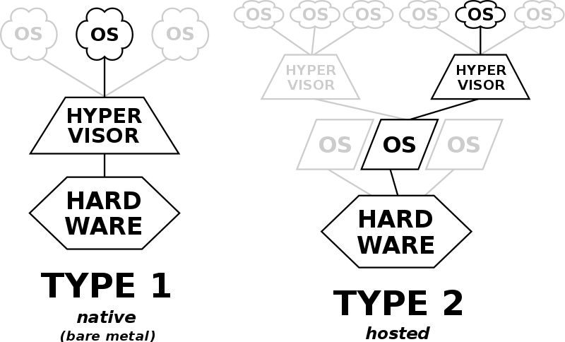

Hypervisor
===========

개요
-----

하이퍼바이저(Hypervisor)란 하나의 컴퓨터에서 다수의 운영체제를 동시에 실행하기 위한 소프트웨어를 말한다. VMM(Virtual Machine Monitor, Virtual Machine Manager)이라고도 한다.

:docs:`virtual_machine`(가상 머신)을 실행하는 컴퓨터를 호스트 머신(Host machine)라고 하고, 각 VM을 게스트 머신(Guest machine)라고 한다.
가상 머신을 실행하려면 프로세스 스케줄러, 메모리 관리, 입출력 관리 등 운영체제 수준의 구성 요소가 필요하다.

하이퍼바이저의 분류
----------------

하이퍼바이저는 하드웨어에 직접 설치해서 실행되는 Native(Bare-metal) 방식과, 애플리케이션으로 설치하는 Hosted 방식으로 분류된다.

- Native(Bare-metal)
	- 호스트 머신의 하드웨어 위에 하이퍼바이저가 직접 설치되어 실행되고, 설치된 하이퍼바이저 위에서 운영체제가 실행된다.
	- Intel Xen, Microsoft Hyper-V, VMWare ESXi 등

- Hosted
	- 운영체제가 설치된 호스트 머신 위에 하이퍼바이저를 애플리케이션으로 실행하고, 하이퍼바이저 애플리케이션 위에서 운영체제가 실행된다.
	- VMware, VirtualBox 등 대부분의 가상화 소프트웨어

참고자료
--------
- `Wikipedia - Hypervisor <https://en.wikipedia.org/wiki/Hypervisor>`_
- `Red Hat - Hypervisor <https://www.redhat.com/ko/topics/virtualization/what-is-a-hypervisor>`_
